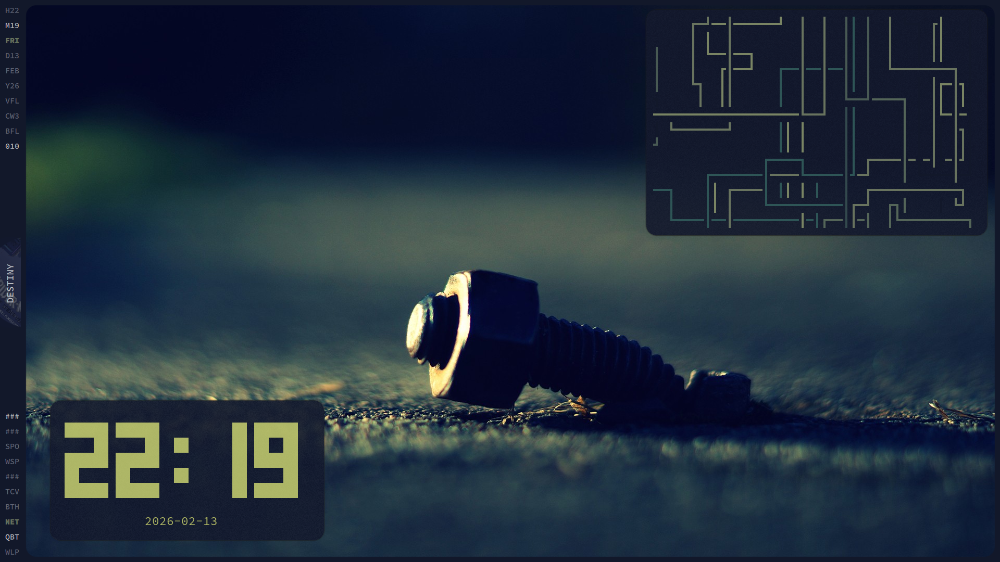
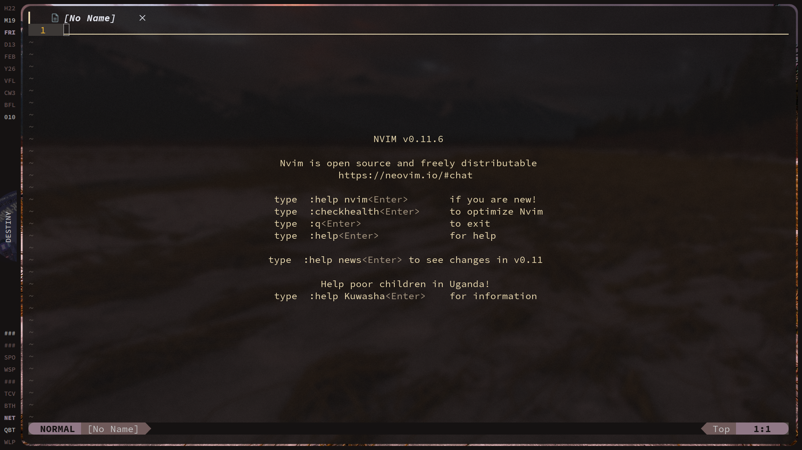

# Hyprland Configuration (hypr-config)

A comprehensive Hyprland desktop configuration featuring dynamic theming with pywal, custom Quickshell bar, and carefully curated tools for a polished Linux desktop experience.

## Screenshots





## Features

- **Dynamic Theming** - Wallpaper-based color schemes using pywal that propagate to all applications
- **Custom Quickshell Bar** - QML-based sidebar with workspace indicators, media controls, and system info
- **Rounded Corners & Blur** - Modern aesthetic with 20px rounded corners and subtle blur effects
- **Scratchpads** - Quick access dropdowns for WhatsApp and Spotify via pyprland
- **Integrated Terminal** - Ghostty with transparency and custom font configuration

## Components

| Component | Application |
|-----------|-------------|
| Window Manager | [Hyprland](https://hyprland.org/) |
| Terminal | [Ghostty](https://ghostty.org/) |
| Shell | [Fish](https://fishshell.com/) |
| Bar/Panel | [Quickshell](https://quickshell.outfoxxed.me/) |
| Editor | [Neovim](https://neovim.io/) |
| File Manager | [Nemo](https://github.com/linuxmint/nemo) / [Yazi](https://yazi-rs.github.io/) |
| Launcher | [Rofi](https://github.com/davatorium/rofi) |
| Wallpaper | [swww](https://github.com/LGFae/swww) |
| Color Schemes | [pywal](https://github.com/dylanaraps/pywal) |
| Scratchpads | [pyprland](https://github.com/hyprland-community/pyprland) |
| Multiplexer | [tmux](https://github.com/tmux/tmux) (oh-my-tmux) |
| PDF Viewer | [Zathura](https://pwmt.org/projects/zathura/) |

## Installation

### Dependencies

```bash
# Core
hyprland ghostty fish rofi swww python-pywal

# Optional utilities
pyprland brightnessctl playerctl wpctl

# Bar & widgets
quickshell

# Development
neovim yazi tmux zathura
```

### Setup

1. Clone the repository:
   ```bash
   git clone https://github.com/yourusername/hypr-config.git ~/.config/hypr-config
   ```

2. Symlink configurations to `~/.config/`:
   ```bash
   ln -sf ~/.config/hypr-config/hypr ~/.config/hypr
   ln -sf ~/.config/hypr-config/ghostty ~/.config/ghostty
   ln -sf ~/.config/hypr-config/fish ~/.config/fish
   ln -sf ~/.config/hypr-config/nvim ~/.config/nvim
   ln -sf ~/.config/hypr-config/quickshell ~/.config/quickshell
   ln -sf ~/.config/hypr-config/yazi ~/.config/yazi
   ln -sf ~/.config/hypr-config/tmux ~/.config/tmux
   ln -sf ~/.config/hypr-config/wal ~/.config/wal
   ```

3. Create a wallpapers directory:
   ```bash
   mkdir ~/Wallpapers
   # Add your wallpapers here
   ```

4. Start the wallpaper daemon and set initial wallpaper:
   ```bash
   swww-daemon &
   ~/scripts/random-wall.sh
   ```

## Keybindings

### General

| Keybind | Action |
|---------|--------|
| `SUPER + Return` | Open terminal (Ghostty) |
| `SUPER + Q` | Close active window |
| `SUPER + D` | Application launcher (Rofi) |
| `SUPER + R` | Run command (Rofi) |
| `SUPER + E` | File manager (Nemo) |
| `SUPER + B` | Web browser (Brave) |
| `SUPER + F` | Toggle fullscreen |
| `SUPER + SHIFT + Space` | Toggle floating |
| `SUPER + SHIFT + E` | Exit Hyprland |

### Workspaces

| Keybind | Action |
|---------|--------|
| `SUPER + 1-0` | Switch to workspace 1-10 |
| `SUPER + SHIFT + 1-0` | Move window to workspace 1-10 |
| `SUPER + Mouse Scroll` | Scroll through workspaces |
| `SUPER + S` | Toggle special workspace (scratchpad) |

### Window Management

| Keybind | Action |
|---------|--------|
| `SUPER + Arrow Keys` | Move focus |
| `SUPER + LMB` | Move window |
| `SUPER + RMB` | Resize window |
| `SUPER + P` | Toggle pseudotile |
| `SUPER + J` | Toggle split |

### Scratchpads (pyprland)

| Keybind | Action |
|---------|--------|
| `SUPER + W` | Toggle WhatsApp |
| `SUPER + S` | Toggle Spotify |

### Media & Hardware

| Keybind | Action |
|---------|--------|
| `XF86AudioRaiseVolume` | Volume up |
| `XF86AudioLowerVolume` | Volume down |
| `XF86AudioMute` | Toggle mute |
| `XF86MonBrightnessUp/Down` | Adjust brightness |
| `XF86AudioPlay` | Play/Pause media |
| `XF86AudioNext/Prev` | Next/Previous track |

### Screenshots

| Keybind | Action |
|---------|--------|
| `SUPER + SHIFT + P` | Screenshot region (hyprshot) |

## Configuration Structure

```
hypr-config/
├── assets/              # Screenshots and images
├── fish/                # Fish shell configuration
│   ├── config.fish      # Main config with aliases
│   ├── functions/       # Custom fish functions
│   └── conf.d/          # Additional configs (fzf, theme)
├── ghostty/
│   └── config           # Terminal configuration
├── gtk-3.0/             # GTK3 settings
├── gtk-4.0/             # GTK4 settings
├── hypr/
│   ├── hyprland.conf    # Main Hyprland configuration
│   ├── rules.conf       # Window rules
│   └── pyprland.json    # Scratchpad configuration
├── nvim/
│   ├── init.lua         # Neovim entry point
│   └── lua/
│       ├── config/      # Core config (keymaps, options, lazy)
│       └── plugins/     # Plugin configurations
├── ohmyposh/
│   └── zen.json         # Shell prompt theme
├── quickshell/
│   ├── shell.qml        # Main bar implementation
│   ├── Colors.qml       # Dynamic color definitions
│   └── mask.frag        # Shader for visual effects
├── scripts/
│   ├── random-wall.sh   # Random wallpaper + pywal
│   ├── restart-dunst.sh # Reload notifications with new colors
│   └── ...              # Various utility scripts
├── tmux/
│   ├── tmux.conf        # oh-my-tmux configuration
│   └── tmux.conf.local  # Local overrides
├── wal/
│   ├── templates/       # pywal templates for apps
│   │   ├── Colors.qml   # Quickshell colors
│   │   ├── dunstrc      # Notification colors
│   │   └── cava-config  # Audio visualizer colors
│   └── colorschemes/    # Custom color schemes
├── waybar/              # Alternative bar config (unused)
├── yazi/
│   └── yazi.toml        # File manager configuration
└── zathura/
    └── zathurarc        # PDF viewer configuration
```

## Dynamic Theming

This configuration uses **pywal** to generate color schemes from wallpapers and propagate them across applications:

1. **Wallpaper Change** → `random-wall.sh` picks a random wallpaper
2. **swww** smoothly transitions to the new wallpaper
3. **pywal** extracts colors and generates config files from templates
4. **Applications** reload with new colors:
   - Hyprland borders (`colors-hyprland.conf`)
   - Quickshell bar (`Colors.qml`)
   - Dunst notifications (`dunstrc`)
   - Neovim (lualine pywal theme)
   - Cava audio visualizer

### Adding pywal Templates

Place template files in `~/.config/wal/templates/`. Templates use `{color0}` through `{color15}` placeholders which pywal replaces with the generated palette.

## Fish Shell Aliases

| Alias | Command | Description |
|-------|---------|-------------|
| `r` | `yazi` | File manager |
| `v` | `nvim` | Neovim |
| `ls` | `eza -a --icons` | Listing with icons |
| `ll` | `eza -al --icons` | Long listing |
| `lt` | `eza -a --tree --level=1 --icons` | Tree view |
| `cat` | `bat` | Syntax highlighting |
| `cd` | `z` | zoxide smart cd |
| `c` | `clear` | Clear terminal |
| `gc` | `git commit -m` | Git commit |
| `ga` | `git add .` | Git add all |
| `gp` | `git push origin main` | Git push |
| `gs` | `git status` | Git status |

## Neovim Setup

This configuration uses **lazy.nvim** as the plugin manager with:

- **LSP** - Language server protocol support via nvim-lspconfig
- **which-key** - Keybinding hints and documentation
- **neo-tree** - File explorer (right side)
- **lualine** - Status line with pywal theme
- **transparent.nvim** - Transparent background for terminal blending

## Autostart Applications

On Hyprland startup, the following are launched:

- `nm-applet` - Network manager tray
- `blueman-applet` - Bluetooth manager tray
- `pypr` - Pyprland daemon for scratchpads
- `swww-daemon` - Wallpaper daemon
- `qs` - Quickshell bar

## Customization

### Change Default Terminal
Edit `hypr/hyprland.conf`:
```conf
$terminal = ghostty  # Change to your preferred terminal
```

### Change Launcher
```conf
$menu = rofi -show drun -show-icons
```

### Adjust Window Gaps
```conf
general {
    gaps_in = 3
    gaps_out = 15
    border_size = 0
}
```

### Modify Corner Rounding
```conf
decoration {
    rounding = 20
    rounding_power = 2
}
```

## Credits

- [Hyprland](https://hyprland.org/) - Amazing Wayland compositor
- [oh-my-tmux](https://github.com/gpakosz/.tmux) - tmux configuration framework
- [pywal](https://github.com/dylanaraps/pywal) - Color scheme generation
- [Quickshell](https://quickshell.outfoxxed.me/) - QML-based shell framework

## License

MIT License - Feel free to use and modify this configuration.
